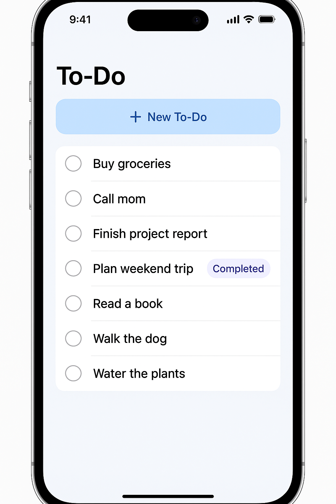
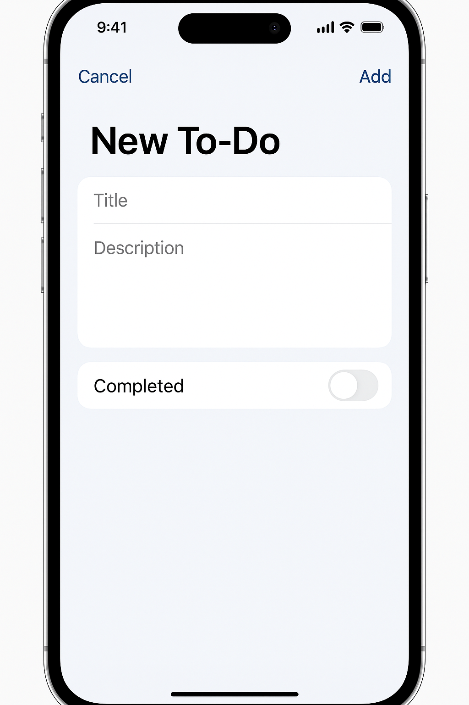

# Real-Time TODO Application

A modern, collaborative task management system with real-time synchronization, offline support, and seamless multi-device experience.

## Overview

This application provides a robust TODO management platform built with React frontend and Go backend, utilizing PostgreSQL for data persistence and WebSockets for real-time collaboration. Users can create, manage, and share TODO lists with instant synchronization across all connected devices.


*Main TODO list interface showing task management and creation*


*The main TODO list interface showing a clean, intuitive design for managing tasks*

### Key Features

- **Real-Time Collaboration**: Changes sync instantly across all devices via WebSockets
- **Offline Support**: Full functionality offline with automatic sync on reconnection
- **List Sharing**: Share lists with other users with customizable permissions
- **Activity Tracking**: Complete audit trail of all changes
- **Responsive Design**: Works seamlessly on web and mobile devices
- **Conflict Resolution**: Automatic handling of concurrent edits

## Technology Stack

| Component | Technology | Purpose |
|-----------|------------|---------|
| Frontend | React 18 + TypeScript | Type-safe, component-based UI |
| State Management | Redux Toolkit | Predictable state with DevTools support |
| UI Framework | Material-UI v5 | Consistent, accessible components |
| Backend | Go + Gin | High-performance REST & WebSocket APIs |
| Database | PostgreSQL 15 | ACID-compliant data storage |
| Cache | Redis 7 | Session storage & real-time PubSub |
| Real-time | WebSockets | Low-latency bidirectional communication |
| Auth | JWT | Stateless authentication |
| Monitoring | Prometheus + Grafana | Metrics and observability |

## Architecture

The system follows a microservices architecture with clear separation of concerns:

```
┌─────────────┐     ┌─────────────┐
│ React Web   │     │React Native │
│    App      │     │    App      │
└──────┬──────┘     └──────┬──────┘
       │                   │
       └─────────┬─────────┘
                 │
         ┌───────▼────────┐
         │ Load Balancer  │
         └───────┬────────┘
                 │
    ┌────────────┴────────────┐
    │                         │
┌───▼────┐              ┌────▼────┐
│  API   │              │WebSocket│
│Servers │              │ Servers │
└───┬────┘              └────┬────┘
    │                        │
    └───────┬────────────────┘
            │
    ┌───────▼────────┐
    │     Redis      │
    │ Cache & PubSub │
    └───────┬────────┘
            │
    ┌───────▼────────┐
    │  PostgreSQL    │
    │   Database     │
    └────────────────┘
```

## Getting Started

### Prerequisites

- Go 1.21+
- Node.js 18+
- PostgreSQL 15+
- Redis 7+
- Docker & Docker Compose (optional)

### Development Setup

1. **Clone the repository**
   ```bash
   git clone https://github.com/yourusername/todo-app.git
   cd todo-app
   ```

2. **Backend setup**
   ```bash
   cd backend
   cp .env.example .env
   # Configure database and Redis connections in .env
   go mod download
   go run cmd/api/main.go
   ```

3. **Frontend setup**
   ```bash
   cd frontend
   npm install
   npm start
   ```

4. **Database setup**
   ```bash
   psql -U postgres -d todo_db -f backend/migrations/001_initial_schema.sql
   ```

### Docker Development

```bash
docker-compose up -d
```

This starts all services including PostgreSQL and Redis.

## API Documentation

### Authentication

All API endpoints except auth require a valid JWT token in the Authorization header:
```
Authorization: Bearer <token>
```

### Core Endpoints

| Method | Endpoint | Description |
|--------|----------|-------------|
| POST | `/api/auth/register` | Register new user |
| POST | `/api/auth/login` | Login user |
| GET | `/api/lists` | Get user's lists |
| POST | `/api/lists` | Create new list |
| GET | `/api/lists/:id/todos` | Get todos in list |
| POST | `/api/lists/:id/todos` | Create new todo |
| PUT | `/api/todos/:id` | Update todo |
| POST | `/api/lists/:id/share` | Share list with user |

### WebSocket Events

Connect to `/api/ws` with JWT token for real-time updates.

**Client → Server**
- `subscribe`: Subscribe to list updates
- `todo:create`: Create new todo
- `todo:update`: Update todo

**Server → Client**
- `todo:created`: New todo created
- `todo:updated`: Todo updated
- `list:shared`: List shared with you

## Database Schema

The application uses PostgreSQL with the following core tables:

- **users**: User accounts and authentication
- **lists**: TODO lists with ownership and metadata
- **todos**: Individual tasks within lists
- **shares**: List sharing permissions
- **activities**: Audit log of all changes

See `backend/migrations/` for complete schema.

## Development

### Running Tests

```bash
# Backend tests
cd backend
go test ./...

# Frontend tests
cd frontend
npm test
```

### Code Style

- Backend: Follow standard Go conventions with `gofmt`
- Frontend: ESLint + Prettier configuration included

### Building for Production

```bash
# Backend
cd backend
go build -o bin/api cmd/api/main.go

# Frontend
cd frontend
npm run build
```

## Deployment

### Kubernetes

Kubernetes manifests are provided in `k8s/`:

```bash
kubectl apply -f k8s/
```

### Environment Variables

Key environment variables:

- `DATABASE_URL`: PostgreSQL connection string
- `REDIS_URL`: Redis connection string
- `JWT_SECRET`: Secret for JWT signing
- `PORT`: Server port (default: 8080)

## Performance

The system is designed to handle:
- 100,000 active users
- 10 million todos
- 1,000 concurrent WebSocket connections per server
- <200ms API response time (P95)
- <100ms WebSocket message delivery (P95)

## Security

- HTTPS enforced for all connections
- JWT authentication with refresh tokens
- Bcrypt password hashing
- SQL injection prevention
- XSS protection
- Rate limiting (100 requests/minute)

## Monitoring

Prometheus metrics exposed at `/metrics`:
- API response times
- WebSocket connections
- Error rates
- Database performance

Grafana dashboards available in `monitoring/dashboards/`.

## Contributing

1. Fork the repository
2. Create a feature branch
3. Commit your changes
4. Push to the branch
5. Create a Pull Request

Please ensure all tests pass and follow the existing code style.

## License

This project is licensed under the MIT License - see the LICENSE file for details.

## Roadmap

### Phase 1 (MVP) ✅
- Basic CRUD operations
- User authentication
- Simple web UI

### Phase 2 (In Progress) 🚧
- Real-time synchronization
- List sharing
- Activity tracking

### Phase 3 (Planned) 📋
- Offline support
- Mobile applications
- Advanced search

### Phase 4 (Future) 🔮
- Due date reminders
- Recurring todos
- Team workspaces
- AI-powered suggestions