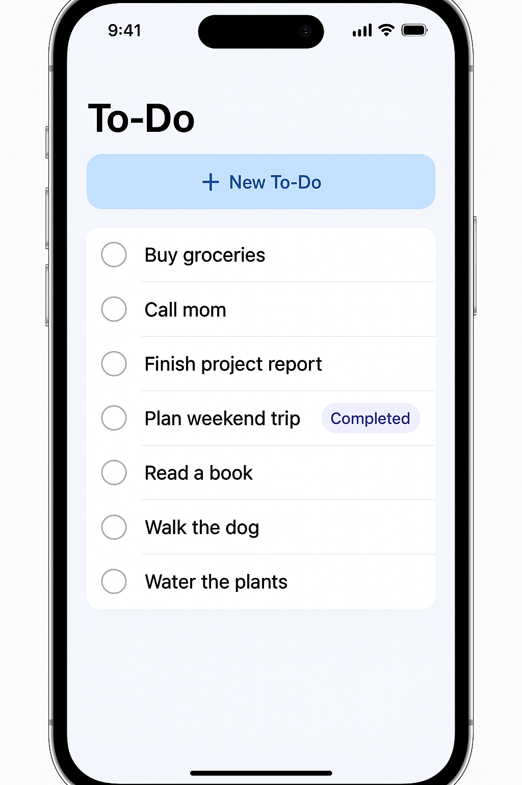

# Real-Time TODO Application Design

**Version**: 1.0  
**Last Updated**: 2025-01-07  
**Status**: In Development

## Executive Summary

The Real-Time TODO Application is a modern, collaborative task management system built with React frontend and Go backend, utilizing PostgreSQL for data persistence. This design achieves sub-100ms real-time synchronization for collaborative editing while providing robust offline support and conflict resolution in distributed environments.

### Key Design Decisions
- **WebSocket Communication**: Real-time updates via persistent connections with REST API fallback
- **Event-Driven Architecture**: All state changes propagated through event system
- **CQRS Pattern**: Separate read/write models for optimal performance
- **Go + PostgreSQL**: High-performance backend with ACID guarantees
- **Optimistic UI Updates**: Immediate feedback with eventual consistency
- **Redis PubSub**: Horizontal scaling for WebSocket servers

## System Architecture

### High-Level Overview


### Core Components

1. **React Frontend**
   - TypeScript for type safety
   - Redux Toolkit for state management
   - Socket.io client for WebSocket communication
   - IndexedDB for offline storage
   - Material-UI component library

2. **Go Backend Service**
   - Gin web framework for REST APIs
   - Gorilla WebSocket for real-time communication
   - GORM for database operations
   - JWT-based authentication
   - Structured logging with zerolog

3. **PostgreSQL Database**
   - Primary-replica setup for read scaling
   - JSONB for flexible metadata storage
   - UUID primary keys for distributed systems
   - Soft deletes for data recovery
   - Optimized indexes for common queries

4. **Redis Cache & Message Broker**
   - Session storage for horizontal scaling
   - PubSub for cross-server WebSocket events
   - Query result caching with TTL
   - Rate limiting counters

### Technology Stack

| Component | Technology | Rationale |
|-----------|------------|-----------|
| Frontend Framework | React 18 | Modern, performant, large ecosystem |
| Frontend Language | TypeScript | Type safety, better tooling |
| State Management | Redux Toolkit | Predictable state, time-travel debugging |
| UI Components | Material-UI v5 | Consistent design, accessibility |
| Backend Language | Go 1.21 | Performance, concurrency, simplicity |
| Web Framework | Gin | Fast, minimal, good middleware |
| Database | PostgreSQL 15 | ACID, JSON support, reliability |
| Cache/PubSub | Redis 7 | Performance, PubSub, proven |
| Container | Docker | Consistent environments |
| Orchestration | Kubernetes | Scaling, resilience |
| Monitoring | Prometheus/Grafana | Go native support |

## Core Concepts

### 1. User & Authentication
Every user has a unique account with JWT-based authentication:
- Email/password registration with validation
- JWT access tokens (24h expiry) and refresh tokens (7d)
- Session management via Redis for instant revocation
- Role-based permissions for future team features

### 2. List Management
Lists are the primary organizational unit:
- **Ownership**: Each list has one owner
- **Sharing**: Lists can be shared with read/write permissions
- **Metadata**: Title, description, color, archive status
- **Ordering**: Custom position field for drag-and-drop

### 3. TODO Items
TODOs are the core work units within lists:
- **Attributes**: Title, description, status, priority, due date
- **Assignment**: Can be assigned to shared list members
- **Positioning**: Maintains order within list
- **Soft Delete**: Completed items remain for history


*Main interface showing TODO items with completion status and quick add button*


*TODO creation form with title, description, and completion toggle*


*Example of the TODO list interface showing various tasks with completion status*


*The streamlined TODO creation form with essential fields*

### 4. Real-Time Synchronization
All changes propagate instantly to connected clients:
1. Client makes change (optimistic update)
2. Change sent to backend via REST or WebSocket
3. Backend validates and persists change
4. Event published to Redis PubSub
5. All WebSocket servers receive event
6. Event broadcast to relevant connected clients
7. Clients update local state

### 5. Offline Support
Seamless experience during network interruptions:
- IndexedDB stores full data snapshot
- Offline changes queued locally
- Automatic sync on reconnection
- Conflict resolution via last-write-wins
- Full activity history for audit trail

## API Design

### REST Endpoints

| Method | Endpoint | Purpose | 
|--------|----------|---------|
| POST | `/api/auth/register` | User registration |
| POST | `/api/auth/login` | User login |
| POST | `/api/auth/refresh` | Refresh JWT token |
| GET | `/api/lists` | Get user's lists |
| POST | `/api/lists` | Create new list |
| PUT | `/api/lists/:id` | Update list |
| DELETE | `/api/lists/:id` | Archive list |
| GET | `/api/lists/:id/todos` | Get todos with pagination |
| POST | `/api/lists/:id/todos` | Create todo |
| PUT | `/api/todos/:id` | Update todo |
| DELETE | `/api/todos/:id` | Delete todo |
| POST | `/api/lists/:id/share` | Share list |
| GET | `/api/activities` | Get activity feed |

### WebSocket Events

#### Client → Server Events
- `subscribe`: Subscribe to list updates
- `unsubscribe`: Unsubscribe from list
- `todo:create`: Create new todo
- `todo:update`: Update existing todo
- `todo:delete`: Delete todo
- `presence:update`: Update user presence

#### Server → Client Events
- `todo:created`: New todo created
- `todo:updated`: Todo updated
- `todo:deleted`: Todo deleted
- `list:updated`: List metadata changed
- `list:shared`: List shared with user
- `presence:changed`: User presence update
- `sync:required`: Client should re-sync

## Data Models

### Database Schema

```sql
-- Users table
CREATE TABLE users (
    user_id UUID PRIMARY KEY DEFAULT gen_random_uuid(),
    email VARCHAR(255) UNIQUE NOT NULL,
    username VARCHAR(100) UNIQUE NOT NULL,
    password_hash VARCHAR(255) NOT NULL,
    created_at TIMESTAMP WITH TIME ZONE DEFAULT CURRENT_TIMESTAMP,
    updated_at TIMESTAMP WITH TIME ZONE DEFAULT CURRENT_TIMESTAMP
);

-- Lists table
CREATE TABLE lists (
    list_id UUID PRIMARY KEY DEFAULT gen_random_uuid(),
    owner_id UUID NOT NULL REFERENCES users(user_id),
    name VARCHAR(255) NOT NULL,
    description TEXT,
    color VARCHAR(7),
    position INTEGER NOT NULL DEFAULT 0,
    is_archived BOOLEAN DEFAULT FALSE,
    created_at TIMESTAMP WITH TIME ZONE DEFAULT CURRENT_TIMESTAMP,
    updated_at TIMESTAMP WITH TIME ZONE DEFAULT CURRENT_TIMESTAMP
);

-- Todos table
CREATE TABLE todos (
    todo_id UUID PRIMARY KEY DEFAULT gen_random_uuid(),
    list_id UUID NOT NULL REFERENCES lists(list_id) ON DELETE CASCADE,
    title VARCHAR(500) NOT NULL,
    description TEXT,
    status VARCHAR(20) NOT NULL DEFAULT 'pending',
    priority VARCHAR(20) NOT NULL DEFAULT 'medium',
    due_date TIMESTAMP WITH TIME ZONE,
    assigned_to UUID REFERENCES users(user_id),
    created_by UUID NOT NULL REFERENCES users(user_id),
    position INTEGER NOT NULL DEFAULT 0,
    completed_at TIMESTAMP WITH TIME ZONE,
    created_at TIMESTAMP WITH TIME ZONE DEFAULT CURRENT_TIMESTAMP,
    updated_at TIMESTAMP WITH TIME ZONE DEFAULT CURRENT_TIMESTAMP
);

-- Shares table
CREATE TABLE shares (
    share_id UUID PRIMARY KEY DEFAULT gen_random_uuid(),
    list_id UUID NOT NULL REFERENCES lists(list_id) ON DELETE CASCADE,
    user_id UUID NOT NULL REFERENCES users(user_id),
    permission VARCHAR(20) NOT NULL DEFAULT 'read',
    created_at TIMESTAMP WITH TIME ZONE DEFAULT CURRENT_TIMESTAMP,
    UNIQUE(list_id, user_id)
);

-- Activities table
CREATE TABLE activities (
    activity_id UUID PRIMARY KEY DEFAULT gen_random_uuid(),
    entity_type VARCHAR(50) NOT NULL,
    entity_id UUID NOT NULL,
    user_id UUID NOT NULL REFERENCES users(user_id),
    action VARCHAR(50) NOT NULL,
    metadata JSONB,
    created_at TIMESTAMP WITH TIME ZONE DEFAULT CURRENT_TIMESTAMP
);

-- Indexes for performance
CREATE INDEX idx_lists_owner ON lists(owner_id);
CREATE INDEX idx_todos_list ON todos(list_id);
CREATE INDEX idx_todos_assigned ON todos(assigned_to);
CREATE INDEX idx_shares_user ON shares(user_id);
CREATE INDEX idx_activities_entity ON activities(entity_type, entity_id);
CREATE INDEX idx_activities_created ON activities(created_at);
```

## Performance Characteristics

### Latency Targets (P95)
- REST API responses: <200ms
- WebSocket message delivery: <100ms  
- Database queries: <50ms
- Full page load: <2s on 3G

### Scale Targets
- Concurrent users: 10,000
- Total users: 100,000
- Total todos: 10,000,000
- WebSocket connections/server: 1,000
- API requests/second: 1,000

### Optimization Strategies
- Database connection pooling
- Redis caching for hot data
- Pagination for large lists
- Debounced real-time updates
- CDN for static assets

## Security Architecture

### Authentication & Authorization
- JWT tokens with RS256 signing
- Refresh token rotation
- CORS with whitelist
- CSRF protection for web

### Data Protection
- HTTPS everywhere
- Bcrypt password hashing
- SQL injection prevention via prepared statements
- XSS protection via React
- Input validation on all endpoints

### Rate Limiting
- 100 requests/minute per user
- 10 failed login attempts/hour
- 1000 WebSocket messages/hour
- Redis-based distributed counting

## Error Handling

### API Error Responses
```json
{
  "success": false,
  "error": {
    "code": "VALIDATION_ERROR",
    "message": "Invalid input data",
    "details": {
      "field": "email",
      "reason": "Invalid email format"
    }
  }
}
```

### Error Categories
- **400 Bad Request**: Invalid input
- **401 Unauthorized**: Missing/invalid auth
- **403 Forbidden**: Insufficient permissions
- **404 Not Found**: Resource doesn't exist
- **409 Conflict**: State conflict
- **429 Too Many Requests**: Rate limited
- **500 Internal Error**: Server fault

### Client Error Recovery
- Automatic retry with exponential backoff
- Offline queue for failed mutations
- User notification for critical errors
- Fallback to cached data when possible

## Implementation Roadmap

### Phase 1: MVP (Weeks 1-4)
- ✅ Database schema design
- ✅ Basic Go API structure
- ✅ Authentication system
- 🚧 CRUD operations for lists/todos
- 🚧 Basic React UI
- 📋 Docker containerization

### Phase 2: Real-Time (Weeks 5-8)
- 📋 WebSocket server implementation
- 📋 Redis PubSub integration
- 📋 Real-time event system
- 📋 Optimistic UI updates
- 📋 Presence indicators

### Phase 3: Offline & Polish (Weeks 9-12)
- 📋 IndexedDB integration
- 📋 Offline queue system
- 📋 Conflict resolution
- 📋 Activity feed
- 📋 Search functionality
- 📋 Performance optimization

### Phase 4: Scale & Features (Weeks 13-16)
- 📋 Kubernetes deployment
- 📋 Monitoring dashboard
- 📋 React Native app
- 📋 Due date reminders
- 📋 Recurring todos
- 📋 Team workspaces

## Monitoring & Operations

### Key Metrics
- API response times by endpoint
- WebSocket connection count
- Active user count
- Database query performance
- Error rates by type
- Cache hit rates

### Logging Strategy
- Structured JSON logs
- Correlation IDs for tracing
- User actions audit trail
- Error stack traces
- Performance timing

### Health Checks
- `/health` - Basic liveness
- `/ready` - Full readiness check
- Database connectivity
- Redis connectivity
- Disk space checks

## Deployment Architecture

### Container Strategy
```yaml
# docker-compose.yml
version: '3.8'
services:
  api:
    build: ./backend
    environment:
      - DATABASE_URL=postgres://...
      - REDIS_URL=redis://...
    ports:
      - "8080:8080"
  
  frontend:
    build: ./frontend
    environment:
      - REACT_APP_API_URL=http://api:8080
    ports:
      - "3000:3000"
  
  postgres:
    image: postgres:15
    volumes:
      - pgdata:/var/lib/postgresql/data
  
  redis:
    image: redis:7-alpine
```

### Production Deployment
- Kubernetes for orchestration
- Horizontal pod autoscaling
- Ingress with TLS termination
- Persistent volumes for data
- Rolling updates with health checks

## Future Enhancements

### Version 2.0
- GraphQL API option
- Advanced permissions system
- File attachments
- Email notifications
- Calendar integration
- Markdown support

### Version 3.0
- AI-powered suggestions
- Voice commands
- Advanced analytics
- Third-party integrations
- Enterprise SSO
- Compliance features

## Key Design Principles

1. **Optimistic Updates**: Immediate UI feedback for better UX
2. **Eventual Consistency**: Tolerate temporary inconsistencies
3. **Graceful Degradation**: Function offline or during failures
4. **Progressive Enhancement**: Core features work everywhere
5. **Security First**: Defense in depth at every layer

## Next Steps

1. Set up development environment
2. Initialize Go project structure
3. Create database migrations
4. Implement authentication
5. Build CRUD endpoints
6. Create React app scaffold
7. Implement core UI components
8. Add WebSocket support
9. Deploy to staging environment